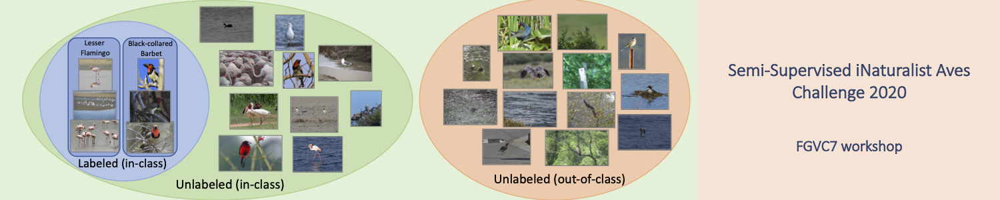
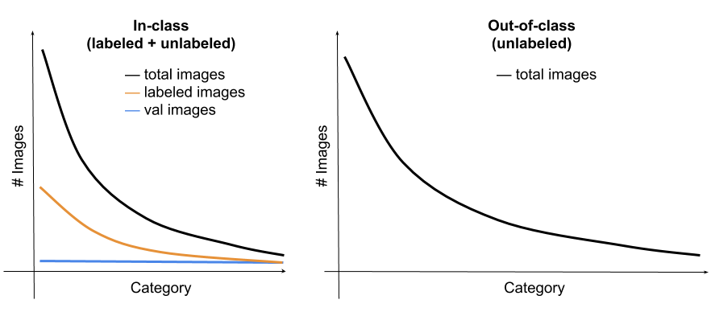

## Semi-Supervised Fine-Grained Recognition Challenge at FGVC7
This challenge is focussed on learning from partially labeled data, a
form of semi-supervised learning.
This dataset is designed to expose some of the challenges encountered in a realistic setting,
such as the fine-grained similarity between classes, significant class
imbalance, and domain mismatch between the labeled and unlabeled data.

This challenge is part of the
[FGVC7 workshop](https://sites.google.com/view/fgvc7) at
[CVPR 2020](http://cvpr2020.thecvf.com/).
Teams with top submissions, at the discretion of the workshop
organizers, will be invited to present their work at the workshop.

The competition will be hosted on [Kaggle](https://www.kaggle.com/c/semi-inat-2020).

Please open an issue (or email `jcsu@cs.umass.edu`) if you have questions or problems
with the dataset.

### Updates
* 2/27/2020: Dataset finalized, solution and Kaggle are ready.
* 3/14/2020: We found problems in the data annoataion. We will fix and collect new data soon. The competition is paused for now.
* 3/25/2020: **Dataset has been updated (v2), please use the new version. If you downloaded before 3/25 please discard them.**
* 4/23/2020: **The deadline has been extended from 5/11 to 5/26**.
* 10/6/2020: Test set labels are released.
* 3/10/2021: **[Second Semi-Supervised Challenge](https://github.com/cvl-umass/semi-inat-2021) at FGVC 8 at CVPR 2021 is released.&&


### Important Dates
|Event|Date|
|:------:|:---------------:|
Data Released|March 9, 2020|
Submission Server Open |March 9, 2020|
Submission Deadline|May 26, 2020|
Winners Announced|June 1, 2020|

### Content
- [Dataset Intro](#the-semi-supervised-inaturalist-aves-dataset)
- [Guideline](#challenge-guidelines)
- [Data and Annotations](#data-and-annotations)
- [Submission Format](#submission-format)
- [Baseline](#baseline-performace)
- [Terms of Use](#terms-of-use)
- [Acknowledgements](#acknowledgements)


## The Semi-Supervised iNaturalist-Aves Dataset

This challenge focusses on Aves (birds) classification where we
provide labeled data of the target classes and unlabeled data from
target and non-target classes.
The data is obtained from iNaturalist, a community
driven project aimed at collecting observations of biodiversity.
See information below about how this challenge relates to previous
iNaturalist challenges at FGVC and other existing datasets.

Our dataset comes with standard training, validation and test sets.
The training set consists of:

* **labeled images** from 200 species of
Aves (birds), where 10% of the images are labeled.
* **unlabeled images** from the same set of classes
as the labeled images (**in-class**).
* **unlabeled images** from a different set of classes as the
  labeled set (**out-of-class**). 
  These images are from a different set of classes in the Aves taxa.
  This reflects a common scenario where a coarser taxonomic label of
  an image can be easily obtained.
  
The validation and test set contain 10 and 20
images respectively for each of the 200 categories in the labeled set.
The distributions of these images are shown in the table below.

| Split | Details | Classes	| Images |
|:------:|:-------:|:--------:|:-------------:|
Train | Labeled | 200 |3,959|
Train | Unlabeled, in-class | 200 |26,640|
Train | Unlabeled, out-of-class | - |122,208|
Val  | Labeled | 200 | 2,000|
Test | Public | 200 |4,000|
Test | Private| 200 |4,000|

The number of images per class follows a heavy-tailed distribution as
shown in the Figure below.



### Evaluation Criteria
The performance will be measured as the per-image accuracy (top 1) on
the test set. The images in the test set are guaranteed to be one of
the 200 categories in the training set.

### Differences from Previous iNaturalist Challenges at FGVC
This challenge differs from previous iNaturalist competitions in two ways:

1. **Novel images:** Our dataset contains a subset of species from Aves kingdom of the [iNaturalist
  2018 Competition
  dataset](https://github.com/visipedia/inat_comp/tree/master/2018). 
  However, all the images in this competition are new and have no overlap
  between previous competitions.

1. **Use of unlabeled data:** We provide two parts of unlabeled data: 1)
  **in-class** where the
 images are from the same classes of labeled data, and 2) **out-of-class** where the images are from other Aves species but also
collected from iNaturalist. 


### Differences from Existing Semi-Supervised Benchmarks
Unlike prior benchmarks on semi-supervised learning our dataset
exposes the following challenges:
1. Long-tailed distribution of classes. 
2. The unlabeled data come from both target and non-target classes.
3. Fine-grained similarity between classes. 

## Challenge Guidelines

Participants **are allowed** to use the labeled and unlabeled images in the
training and validation set in any way they like. Participants are
**not allowed** to use images, labels, or pre-trained
models from previous iNaturalist competitions or any other datasets. 
However, participants **are allowed** to use ImageNet pre-trained
model (e.g., pre-trained models from
[torchvision](https://pytorch.org/docs/stable/torchvision/models.html)).
If you cannot verify the training set of a model, we strongly urge you
to not use them because of the potential overlap of class labels.

The general rule is that participants should only use the provided
images and annotations (except for the ImageNet
pre-trained models) to train a model. 
For example, dataset from previous iNaturalist competitions or other
existing datasets, collecting data from the web or iNaturalist
website, or additional annotation on the provided images is **not
permitted**.


## Data and Annotations

All the images are stored in JPEG format and have a maximum dimension of 500px.

You can download the dataset files here or on [Kaggle](https://www.kaggle.com/c/semi-inat-2020): 
  * Labeled training and validation [images [533MB]](https://drive.google.com/file/d/1xsgOcEWKG9CszNNT_EXN3YB1OLPYNbf8/view?usp=sharing)
      
  * Unlabeled **in-class** training [images [2.3GB]](https://drive.google.com/file/d/1BiEkIp8yuqB5Vau_ZAFAhwp8CNoqVjRk/view?usp=sharing)
      
  * Unlabeled **out-of-class** training [images [11.0GB]](https://drive.google.com/file/d/18gZhCEKJkxKkUbG49syAuWPdfL0Lm9tp/view?usp=sharing)
      
  * Test [images [722MB]](https://drive.google.com/file/d/1OVEA2lNJnYM5zxh3W_o_Q6K5lsNmJ9Hy/view?usp=sharing)
      
  * All labeled/unabeled training/val/test [annotations [2.0MB]](https://drive.google.com/file/d/1nX-ob0rk_WpylgiZyf7vxOrgJJXHraPi/view?usp=sharing)

We follow the annotation format of the [COCO dataset](http://mscoco.org/dataset/#download) and add additional fields. The annotations are stored in the [JSON format](http://www.json.org/) and are organized as follows:

```
{
  "info" : info,
  "images" : [image],
  "annotations" : [annotation],
}

info{
  "year" : int,
  "version" : str,
  "description" : str,
  "contributor" : str,
  "url" : str,
  "date_created" : datetime,
}

image{
  "id" : int,
  "width" : int,
  "height" : int,
  "file_name" : str
}

annotation{
  "id" : int,
  "image_id" : int,
  "category_id" : int
}

```
For unlabeled data (either in-domain or out-of-domain), `category_id=-1`. 

For test data, the value for `annotations` is empty.


## Submission Format
The submission format for the Kaggle competition is a csv file with
the following format:

```
Id,Category
0,25 4 122 99 23
1,0 23 33 32 152
2,143 177 134 113 199
```
The `Id` corresponds to the test image Id. The `Category`
corresponds to the top five predicted categories separated by
space. 
You should have one row for each test image. Although we only
use top-1 accuracy for the leaderboard, the top-5 predictions will be
used for more detailed analysis by the competition organizers. 
A [sample solution](solution_sample.csv) is provided.


## Test Set Labels
[Test set labels](solution.csv) are provided.


## Baseline Performace
The performance using a fine-tuned ImageNet pre-trained
[ResNet-50](https://pytorch.org/docs/stable/_modules/torchvision/models/resnet.html)
on 224x224 images on the labeled (in class) data only is shown below.
We hope you can significantly improve the performance using the
unlabeled data.

| Training Data | Method| Top-1 Val. Accuracy (%) | 
|:-------------:|:-------------:|:-------------:|
Labeled train images|ResNet-50 fine-tune|41.35|


## Terms of Use
By downloading this dataset you agree to the following terms:

1. You will abide by the [iNaturalist Terms of Service](https://www.inaturalist.org/pages/terms)
2. You will use the data only for non-commercial research and educational purposes.
3. You will NOT distribute the above images.
4. UMass Amherst makes no representations or warranties regarding the data, including but not limited to warranties of non-infringement or fitness for a particular purpose.
5. You accept full responsibility for your use of the data and shall defend and indemnify UMass Amherst, including its employees, officers, and agents, against any and all claims arising from your use of the data, including but not limited to your use of any copies of copyrighted images that you may create from the data.


## Acknowledgements
FGVC team, Kaggle team, iNaturalist. Special thanks to Grant van Horn
for help with iNaturalist data.

## Organizer
Jong-Chyi Su (UMass Amherst) `jcsu@cs.umass.edu`

